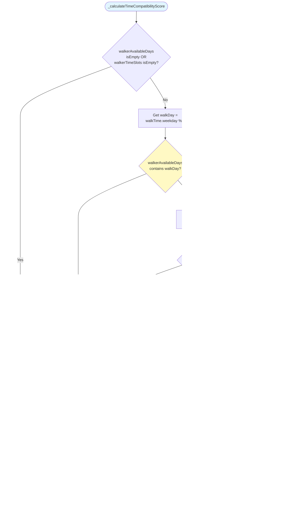

# Dog Walker App - System Diagrams

## 1. UML Class Diagram


## 2. Firebase Firestore Data Model Diagram


## 3. Complex Method Flow Diagrams

### 3.1. Relevance Scoring Algorithm Flow


### 3.2. Unread Message Count Algorithm Flow


### 3.3. Notification Count Update Algorithm Flow


## 4. System Architecture Overview


## 5. Relevance Scoring Algorithm Flow

### 5.1. Relevance Score Calculation Flow


### 5.2. Size Compatibility Score Calculation


### 5.3. Energy Level Compatibility Score Calculation


### 5.4. Time Compatibility Score Calculation



### 5.5. Urgency Score Calculation


### 5.6. Sort By Relevance Flow

```mermaid
flowchart TD
    Start([sortByRelevance Called]) --> Init[Initialize scoredRequests = []]
    
    Init --> LoopStart[For each request<br/>in requests]
    LoopStart --> GetDog[Get dog from dogs map<br/>using request.dogId]
    
    GetDog --> CheckDog{dog == null?}
    CheckDog -->|Yes| Skip[Skip this request<br/>Continue loop]
    CheckDog -->|No| CalcScore[Calculate relevanceScore =<br/>calculateRelevanceScore<br/>walkRequest, dog, walker]
    
    CalcScore --> AddToScored[Add request, score<br/>to scoredRequests]
    AddToScored --> CheckMore{More<br/>requests?}
    Skip --> CheckMore
    
    CheckMore -->|Yes| LoopStart
    CheckMore -->|No| Sort[Sort scoredRequests by score<br/>descending highest first]
    
    Sort --> Map[Map scoredRequests to<br/>List of WalkRequestModel]
    Map --> Return([Return sorted list])
    
    style Start fill:#e1f5ff
    style Return fill:#c8e6c9
    style CalcScore fill:#fff9c4
    style Sort fill:#fff9c4
```

## 6. Complex Chat Method Flow Diagrams

### 5.1. Chat List Fetching Algorithm Flow

```mermaid
flowchart TD
    Start([_fetchChats Called]) --> SetLoading[Set _loading = true]
    SetLoading --> GetUser[Get user from AuthProvider]
    GetUser --> CheckUser{user exists?}
    CheckUser -->|No| End1([End - Return])
    CheckUser -->|Yes| CheckUserType{user.userType?}
    
    CheckUserType -->|dogWalker| GetWalkerRequests[Query walk_requests<br/>where walkerId == user.id]
    CheckUserType -->|dogOwner| GetOwnerRequests[Query walk_requests<br/>where ownerId == user.id]
    
    GetWalkerRequests --> InitChats[Initialize chats = []]
    GetOwnerRequests --> InitChats
    
    InitChats --> LoopStart[Loop through walkRequests]
    LoopStart --> DetermineOther[Determine otherUserId:<br/>if walker: otherUserId = walk.ownerId<br/>if owner: otherUserId = walk.walkerId]
    
    DetermineOther --> CheckOther{otherUserId<br/>isEmpty?}
    CheckOther -->|Yes| SkipChat[Skip this chat - continue loop]
    CheckOther -->|No| GetOtherUser[Get otherUser by otherUserId]
    
    GetOtherUser --> CheckOtherUser{otherUser<br/>exists?}
    CheckOtherUser -->|No| SkipChat
    CheckOtherUser -->|Yes| GetDog[Get dog by walk.dogId]
    
    GetDog --> CreateChatId[Create chatId:<br/>'walk_{walk.id}_{ownerId}_{walkerId}']
    CreateChatId --> GetLastMsg[Get lastMessage for chatId]
    
    GetLastMsg --> CheckActive{lastMessage exists OR<br/>walk.status == accepted OR<br/>walk.status == completed?}
    CheckActive -->|No| SkipChat
    CheckActive -->|Yes| AddChat[Add to chats list:<br/>chatId, walkRequest, otherUser, dog, lastMessage]
    
    AddChat --> CheckMore{More walkRequests?}
    SkipChat --> CheckMore
    CheckMore -->|Yes| LoopStart
    CheckMore -->|No| AddExistingChats[Call _addExistingChats<br/>to find chats in messages collection]
    
    AddExistingChats --> SortChats[Sort chats by timestamp:<br/>lastMessage.timestamp OR walkRequest.startTime<br/>descending order]
    SortChats --> UpdateState[setState: _chats = chats<br/>_loading = false]
    
    UpdateState --> SetupListeners[For each chat:<br/>Setup real-time message listener]
    SetupListeners --> CalcQuick[Call _calculateUnreadCountsQuick<br/>for fast initial display]
    CalcQuick --> End2([End])
    
    style Start fill:#90EE90
    style End1 fill:#FFB6C1
    style End2 fill:#90EE90
    style GetWalkerRequests fill:#E6E6FA
    style GetOwnerRequests fill:#E6E6FA
    style AddChat fill:#90EE90
    style SetupListeners fill:#FFE4B5
    style CalcQuick fill:#FFE4B5
```

### 5.2. Real-time Message Listener Setup Flow

```mermaid
flowchart TD
    Start([_setupMessageListener Called]) --> CancelExisting{Cancel existing<br/>subscription for chatId?}
    CancelExisting -->|Yes| CancelSub[Cancel _messageSubscriptions[chatId]]
    CancelExisting -->|No| CreateListener
    CancelSub --> CreateListener[Create Firestore stream listener:<br/>chats/{chatId}/messages<br/>orderBy timestamp desc<br/>limit 1]
    
    CreateListener --> ListenStart[Start listening to snapshots]
    ListenStart --> SnapshotReceived[Snapshot received]
    SnapshotReceived --> CheckMounted{Widget mounted?}
    CheckMounted -->|No| End1([End - Return])
    CheckMounted -->|Yes| CheckDocs{snapshot.docs<br/>isNotEmpty?}
    
    CheckDocs -->|No| End2([End - No messages])
    CheckDocs -->|Yes| GetLastMsg[Get lastMessageDoc<br/>from snapshot.docs.first]
    
    GetLastMsg --> ExtractData[Extract:<br/>senderId = lastMessageData['senderId']<br/>timestamp = lastMessageData['timestamp']]
    
    ExtractData --> CheckSender{senderId !=<br/>currentUserId AND<br/>timestamp != null?}
    CheckSender -->|No| End3([End - Own message or invalid])
    CheckSender -->|Yes| GetReadTime[Get lastReadTime<br/>from _lastReadTimes[chatId]]
    
    GetReadTime --> CheckUnread{lastReadTime == null OR<br/>timestamp > lastReadTime?}
    CheckUnread -->|No| End4([End - Already read])
    CheckUnread -->|Yes| CalcUnread[Call _getUnreadCount chatId<br/>to get exact unread count]
    
    CalcUnread --> CheckMounted2{Widget still<br/>mounted?}
    CheckMounted2 -->|No| End5([End])
    CheckMounted2 -->|Yes| UpdateState[setState:<br/>_unreadCounts[chatId] = unreadCount]
    
    UpdateState --> FindIndex[Find chat index:<br/>_chats.indexWhere chatId]
    FindIndex --> UpdateChatItem{Index found?}
    UpdateChatItem -->|Yes| UpdateChat[_chats[index]['unreadCount'] = unreadCount<br/>_chats[index]['lastMessage'] = new MessageModel]
    UpdateChatItem -->|No| StoreSub
    UpdateChat --> StoreSub[Store subscription:<br/>_messageSubscriptions[chatId] = subscription]
    StoreSub --> End6([End - Listener active])
    
    style Start fill:#90EE90
    style End1 fill:#FFB6C1
    style End2 fill:#FFB6C1
    style End3 fill:#FFB6C1
    style End4 fill:#FFB6C1
    style End5 fill:#FFB6C1
    style End6 fill:#90EE90
    style CalcUnread fill:#FFE4B5
    style UpdateState fill:#90EE90
    style UpdateChat fill:#90EE90
```

### 5.3. Home Screen Unread Message Count Update Flow

```mermaid
flowchart TD
    Start([_updateUnreadMessageCount Called]) --> GetAuth[Get currentUserId and user<br/>from AuthProvider]
    GetAuth --> CheckAuth{currentUserId and<br/>user exist?}
    CheckAuth -->|No| End1([End - Return])
    CheckAuth -->|Yes| InitCount[Initialize unreadCount = 0]
    
    InitCount --> QueryAllChats[Query all chats collection<br/>from Firestore]
    QueryAllChats --> LoopChats[Loop through each chatDoc]
    
    LoopChats --> ExtractChatData[Extract:<br/>ownerId = chatData['ownerId']<br/>walkerId = chatData['walkerId']<br/>chatId = chatDoc.id]
    
    ExtractChatData --> CheckParticipant{Check if user is participant:<br/>if owner: ownerId == currentUserId<br/>if walker: walkerId == currentUserId}
    
    CheckParticipant -->|No| SkipChat[Skip this chat - continue loop]
    CheckParticipant -->|Yes| GetReadTime[Get lastReadTime<br/>from _lastReadMessageTime[chatId]]
    
    GetReadTime --> GetLastMsg[Get lastMessage<br/>from MessageService]
    GetLastMsg --> CheckLastMsg{lastMessage exists AND<br/>lastMessage.senderId != currentUserId?}
    
    CheckLastMsg -->|No| SkipChat
    CheckLastMsg -->|Yes| CheckUnread{lastReadTime == null OR<br/>lastMessage.timestamp > lastReadTime?}
    
    CheckUnread -->|No| SkipChat
    CheckUnread -->|Yes| QueryRecent[Query recent messages:<br/>chats/{chatId}/messages<br/>orderBy timestamp desc<br/>limit 50]
    
    QueryRecent --> FilterLoop[Loop through recentMessages]
    FilterLoop --> CheckSender{msgSenderId ==<br/>currentUserId?}
    
    CheckSender -->|Yes| SkipMsg[Skip message - continue loop]
    CheckSender -->|No| CheckTimestamp{lastReadTime exists AND<br/>msgTimestamp > lastReadTime?}
    
    CheckTimestamp -->|Yes| Increment[chatUnreadCount++]
    CheckTimestamp -->|No| CheckOrdered{Messages ordered<br/>by timestamp desc?}
    
    CheckOrdered -->|Yes| BreakEarly[Break early - all remaining<br/>messages are read]
    CheckOrdered -->|No| ContinueLoop[Continue loop]
    
    SkipMsg --> CheckMoreMsg{More messages?}
    ContinueLoop --> CheckMoreMsg
    Increment --> CheckMoreMsg
    BreakEarly --> AddToTotal
    CheckMoreMsg -->|Yes| FilterLoop
    CheckMoreMsg -->|No| AddToTotal[unreadCount += chatUnreadCount]
    
    AddToTotal --> CheckMoreChats{More chats?}
    SkipChat --> CheckMoreChats
    CheckMoreChats -->|Yes| LoopChats
    CheckMoreChats -->|No| CheckMounted{Widget mounted?}
    
    CheckMounted -->|Yes| UpdateState[setState:<br/>_unreadMessageCount = unreadCount]
    CheckMounted -->|No| End2([End])
    UpdateState --> End2
    
    style Start fill:#90EE90
    style End1 fill:#FFB6C1
    style End2 fill:#90EE90
    style CheckParticipant fill:#E6E6FA
    style QueryRecent fill:#FFE4B5
    style Increment fill:#90EE90
    style BreakEarly fill:#FFE4B5
    style UpdateState fill:#90EE90
```
